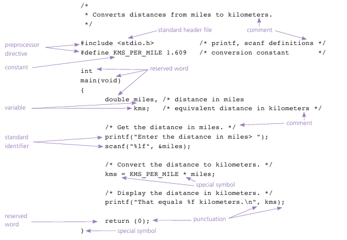

## Overview of C 

**preprocessor directive** -> a C program line beginning with # that provides an instruction to the preprocessor  
**preprocessor** -> a system program that modifies a C program prior to its compilation
**library** -> a collection of useful functions and symbols that may be 
accessed by a program

### Breakdown
- **'#include** ->  gives a program access to a library, causes the preprocessor to insert definitions from a standard header file into a pro
gram before compilation.

- **constant macro KMS_PER_MILE** -> instructs the preprocessor to replace each occurrence of KMS_PER_MILE in the text of the C program by 1.609 before compilation begins.

- **declarations** -> tells the compiler the names of memory cells in a program

- **reserved word** ->  word that has special meaning in C
- **standard identifier** -> a word having special meaning but one 
that a programmer may redefine:
>[!WARNING]
> Redefinition is not recommended!
to name memory 
- **User-Defined Identifiers** -> user chosen names to name memorycells that will hold data and program results and to name operations that we define

| Reserved Words    | Standard Identifiers  | User-Defined Identifiers  |
| ------------- |:-------------:| -----:|
| int, void     | printf, scanf | KMS_PER_MILE,main |
| double        |               |   miles           
| return        |               |    kms            |

>[!TIP]  
> Refer to chapter 2 on the book referenced below for:
> 1. More Deeper explanation
> 2. Rules and warnings when using User-defined identifiers